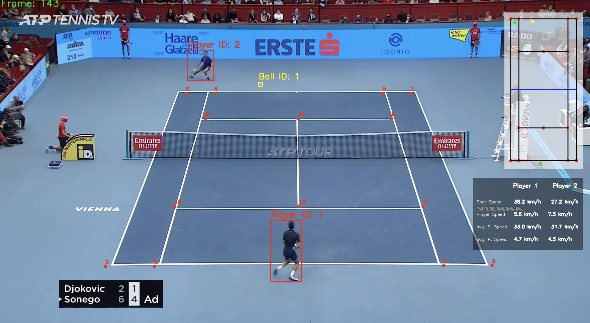

# TENNIS MATCH ANALYSIS AND TRACKING SYSTEM

## OVERVIEW  
# This project analyzes a tennis match video using object tracking and computer vision techniques.
# It detects players and the ball, tracks movements, measures shot speeds, and visualizes data on a mini-court overlay.

## Before

## After

## FEATURES  
# - Player and Ball Detection: Uses YOLO-based object detection models.
# - Court Line Detection: Predicts and marks court keypoints.
# - Tracking and Interpolation:
#   - Tracks players and ball across frames.
#   - Interpolates missing ball positions.
# - Shot Analysis:
#   - Detects shot moments.
#   - Measures ball and player movement speeds in km/h.
# - Mini-Court Visualization:
#   - Maps player and ball positions onto a scaled-down court.
# - Statistical Analysis:
#   - Calculates average shot speeds and movement speeds.
# - Video Output:
#   - Draws bounding boxes and court keypoints.
#   - Saves processed video output.

## DEPENDENCIES  
"Installing dependencies..."
pip install opencv-python pandas torch torchvision ultralytics

## HOW TO RUN  
"Place your input video in the input_vid/ directory."
"Run the following command:"
"python main.py"
"Processed output video will be saved in output_vid/output_vid.avi."

## MODEL REQUIREMENTS  
"Ensure the following models are present in the models/ directory:"
Player Detection Model: yolov8x.pt"
Ball Detection Model: models/last.pt"
Court Detection Model: models/Kyp_model.pth"

## FILE STRUCTURE  
"Project file structure:"
cat <<EOL
├── Analysis/
├── constants/
├── court_line_detector/
├── input_vid/
│   ├── input_video.mp4
├── main.py
├── mini_court/
├── models/
│   ├── last.pt  (Ball detection model)
│   ├── Kyp_model.pth  (Court detection model)
│   ├── yolov8x.pt  (Player detection model)
├── output_vid/
│   ├── output_vid.avi
├── stubs/
│   ├── player_detections.pkl
│   ├── ball_detections.pkl
├── Trackers/
│   ├── PlayerTracker.py
│   ├── BallTracker.py
├── training/
├── utils/
├── yolo.py
EOL

## EXAMPLE OUTPUT  
"Sample output:"
cat <<EOL
Frame: 120
Player 1 Shot Speed: 130 km/h
Player 2 Movement Speed: 6 km/h
EOL

## NOTES  
"Ensure the yolov8x.pt and other model files are properly downloaded in the models/ directory."
"If a .partial file is present, re-download the model to avoid incomplete executions."

## LICENSE  
"This project is open-source and available under the MIT License."